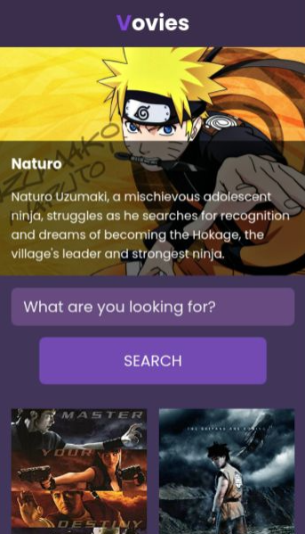
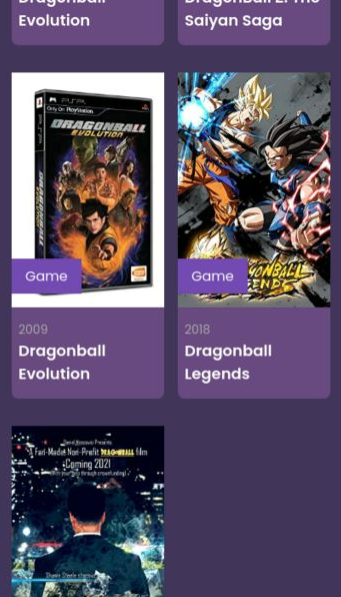
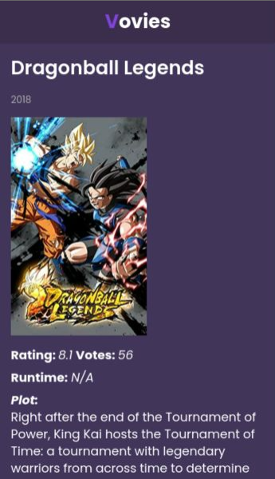

# v-movie-app

## Screenshots


## Project setup
```
yarn install
```
### Create env.js file
Create the env.js file inside the src folder with the following content:
``` javascript
export default {
  apikey: "xxxxxx",
};
```
where "xxxxxx" is your [omdb](http://www.omdbapi.com/) apikey.


### Compiles and hot-reloads for development
```
yarn serve
```

### Compiles and minifies for production
```
yarn build
```

### Lints and fixes files
```
yarn lint
```

### Customize configuration
See [Configuration Reference](https://cli.vuejs.org/config/).

#### Important
1. ***Project in development...***
2. For now only the mobile version
